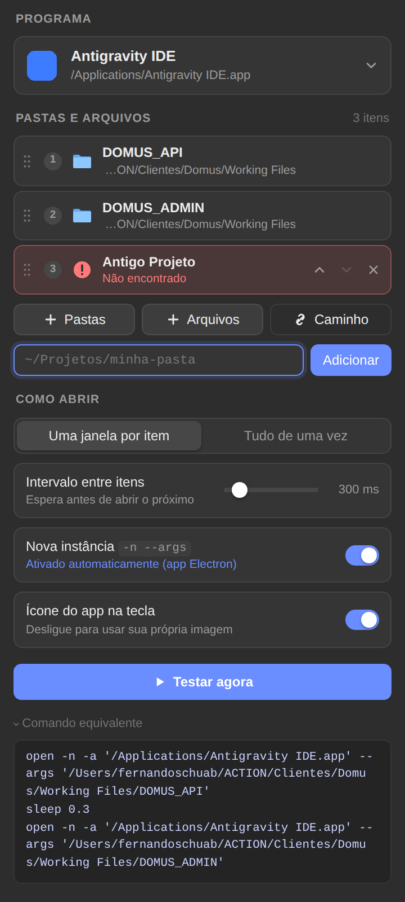
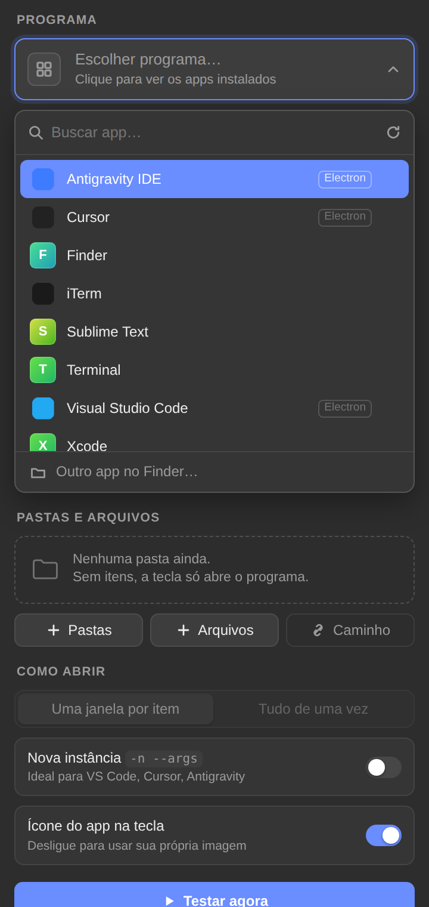

# Abrir Com — plugin Stream Deck (macOS)

Abre **uma ou várias pastas/arquivos** no programa que você escolher (Antigravity, VS Code, Cursor, Finder…) direto do Stream Deck, sem Terminal e sem digitar comando.

 

## Instalar

1. Dê dois cliques em `dist/com.fernandoschuab.openwith.streamDeckPlugin`.
2. No Stream Deck, arraste a ação **Abrir Com › Abrir pastas em…** para uma tecla.

Requisitos: Stream Deck **7.1+** e macOS **12+**.

## Usar

| Campo | O que faz |
|---|---|
| **Programa** | Lista os apps instalados, com busca e ícones (↑/↓ e Enter funcionam). “Outro app no Finder…” abre o seletor do macOS. |
| **+ Pastas / + Arquivos** | Abre o seletor nativo do Finder. Dá para escolher várias de uma vez (⌘-clique). |
| **Caminho** | Digite ou cole um caminho (`~/…`, `Working\ Files` e `file://` são aceitos). Colar várias linhas adiciona todas. |
| Lista | Arraste pelos pontinhos ou use ↑ ↓ para reordenar e × para remover. Itens que não existem aparecem em vermelho. |
| **Como abrir** | *Uma janela por item*: um `open` por pasta, na ordem, com o intervalo escolhido. *Tudo de uma vez*: uma única chamada com todos os caminhos. |
| **Nova instância `-n --args`** | Usa `open -n -a App --args <pasta>`, igual ao seu comando atual. Liga sozinho para apps Electron (VS Code, Cursor, Antigravity). |
| **Ícone do app na tecla** | Usa o ícone do programa como imagem da tecla. |
| **Testar agora** | Executa sem precisar apertar a tecla. |
| **Comando equivalente** | Mostra o comando de shell que será executado. |

Sem pastas na lista, a tecla apenas abre o programa.
Se algum caminho não existir, os demais abrem normalmente e a tecla mostra ⚠️.

Seu caso antigo (Terminal + delay + comando) vira: **Programa** = Antigravity IDE, **Pastas** = `DOMUS_API` e `DOMUS_ADMIN`, modo *Uma janela por item*, *Nova instância* ligada.

## Problemas

- **Logs:** `~/Library/Application Support/com.elgato.StreamDeck/Plugins/com.fernandoschuab.openwith.sdPlugin/logs/`
- **O seletor do Finder abriu atrás de outras janelas:** procure-o com ⌘-Tab (o processo se chama *osascript*).
- **Um app aparece com uma letra no lugar do ícone:** o macOS não forneceu o ícone. É só visual; a ação funciona normalmente.
- **Cache de ícones:** `~/Library/Caches/com.fernandoschuab.openwith/`. Apague para gerar os ícones de novo.

## Desenvolvimento

```bash
npm install
npm run build                      # compila src/ → .sdPlugin/bin/plugin.js
npx streamdeck link com.fernandoschuab.openwith.sdPlugin   # instala em modo dev
npm run watch                      # recompila e reinicia o plugin a cada alteração
npm run pack                       # gera dist/*.streamDeckPlugin
```

Estrutura:

```
src/actions/open-with.ts     ação (tecla, mensagens da UI, ícone da tecla)
src/lib/mac.ts               open, seletores, lista de apps, ícones
*.sdPlugin/ui/open.*         Property Inspector (HTML/CSS/JS puro, sem dependências)
*.sdPlugin/scripts/pick.js   seletor nativo (JXA)
*.sdPlugin/scripts/icons.js  extração de ícones via NSWorkspace (JXA)
test/pi_test.py              teste da UI com Playwright (WebSocket simulado)
```
