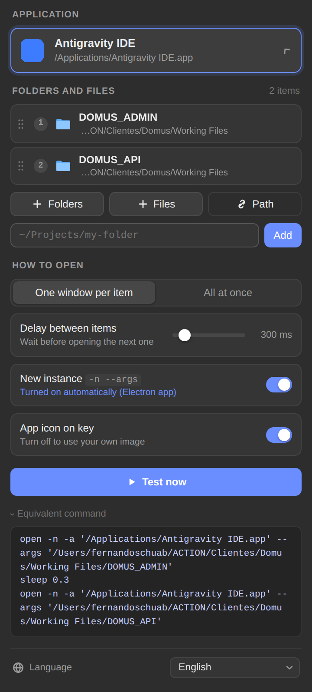
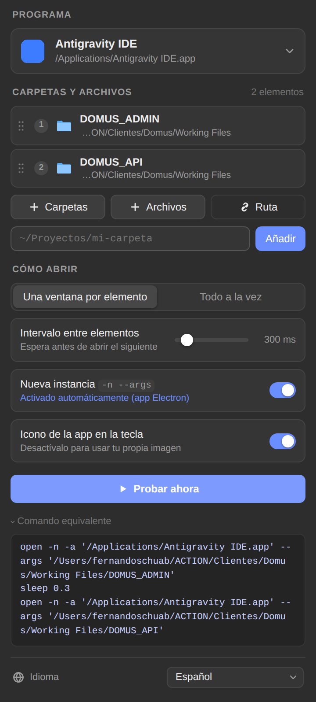

# Open With (Abrir Com) — plugin Stream Deck (macOS e Windows)

Abre **uma ou várias pastas/arquivos** no programa que você escolher (Antigravity, VS Code, Cursor, Finder, Explorador de Arquivos…) direto do Stream Deck, sem Terminal e sem digitar comando.

**Versão atual: 1.1.0** — veja o [histórico de versões](#versões).

  

## Instalar

1. Dê dois cliques em `dist/com.fernandoschuab.openwith.streamDeckPlugin`.
2. No Stream Deck, arraste a ação **Open With › Open folders in…** para uma tecla. Com o Stream Deck em espanhol, ela aparece como **Abrir con › Abrir carpetas en…**.

Requisitos: Stream Deck **7.1+** e **macOS 12+** ou **Windows 10+**. O mesmo instalador serve para os dois sistemas.

## Usar

| Campo | O que faz |
|---|---|
| **Programa** | Lista os apps instalados, com busca e ícones (↑/↓ e Enter funcionam). No Mac vêm de `/Applications`; no Windows, dos atalhos do Menu Iniciar. “Escolher outro app…” abre o seletor do sistema (no Windows, escolha o `.exe`). |
| **+ Pastas / + Arquivos** | Abre o seletor nativo (Finder no Mac, Explorador no Windows). Dá para escolher várias de uma vez (⌘-clique no Mac, Ctrl-clique no Windows). |
| **Caminho** | Digite ou cole um caminho. Colar várias linhas adiciona todas. No Mac: `~/…`, `Working\ Files` e `file://`. No Windows: `C:\…`, `C:/…`, `~\…`, `%USERPROFILE%\…` e caminhos de rede `\\servidor\pasta`. |
| Lista | Arraste pelos pontinhos ou use ↑ ↓ para reordenar e × para remover. Itens que não existem aparecem em vermelho. |
| **Como abrir** | *Uma janela por item*: abre uma pasta por vez, na ordem, com o intervalo escolhido. *Tudo de uma vez*: uma única chamada com todos os caminhos (o programa decide como abri-los). |
| **Nova instância `-n --args`** (só Mac) | Usa `open -n -a App --args <pasta>`, igual ao seu comando atual. Liga sozinho para apps Electron (VS Code, Cursor, Antigravity). No Windows a opção não aparece: lá o programa sempre recebe a pasta como argumento (`Code.exe <pasta>`), o que já abre uma janela nova nesses editores. |
| **Ícone do app na tecla** | Usa o ícone do programa como imagem da tecla. |
| **Testar agora** | Executa sem precisar apertar a tecla. |
| **Comando equivalente** | Mostra o comando que será executado: `open` no Mac, `Start-Process` (PowerShell) no Windows. |

Sem pastas na lista, a tecla apenas abre o programa.
Se algum caminho não existir, os demais abrem normalmente e a tecla mostra ⚠️.

Seu caso antigo (Terminal + delay + comando) vira: **Programa** = Antigravity IDE, **Pastas** = `DOMUS_API` e `DOMUS_ADMIN`, modo *Uma janela por item*, *Nova instância* ligada.

## Idiomas

A tela de configuração está em **português, inglês e espanhol**. Para trocar, use o seletor **Idioma** no rodapé da tela. A escolha vale para todas as teclas.

- **Automático** (padrão): segue o idioma do sistema (macOS ou Windows). Se ele estiver num idioma sem tradução, usa o idioma do Stream Deck e, por último, inglês.
- Os títulos das janelas de seleção ("Escolha uma ou mais pastas") acompanham o idioma escolhido.
- O nome da ação na lista do Stream Deck vem de `en.json` e `es.json`. O Stream Deck não tem português entre os idiomas do app, então com ele em inglês o nome aparece em inglês.

Para adicionar um idioma, siga três passos:

1. Crie o bloco do idioma em `ui/i18n.js`.
2. Adicione o idioma em `src/lib/i18n.ts`.
3. Se o Stream Deck suportar esse idioma (de, fr, ja, ko, zh_CN, zh_TW), crie também o `<código>.json` do manifest.

## Problemas

**Em qualquer sistema**

- **Um app aparece com uma letra no lugar do ícone:** o sistema não forneceu o ícone. É só visual; a ação funciona normalmente.
- **Uma tecla veio de um perfil do outro sistema:** os caminhos (`/Users/…` ou `C:\…`) não existem aqui e aparecem como "Não encontrado". Escolha o programa e as pastas de novo.

**macOS**

- **Logs:** `~/Library/Application Support/com.elgato.StreamDeck/Plugins/com.fernandoschuab.openwith.sdPlugin/logs/`
- **O seletor do Finder abriu atrás de outras janelas:** procure-o com ⌘-Tab (o processo se chama *osascript*).
- **Cache de ícones:** `~/Library/Caches/com.fernandoschuab.openwith/`. Apague para gerar os ícones de novo.

**Windows**

- **Logs:** `%APPDATA%\Elgato\StreamDeck\Plugins\com.fernandoschuab.openwith.sdPlugin\logs\`
- **Primeira vez mais lenta:** na primeira abertura do seletor ou da lista de apps, o plugin prepara um pequeno componente do Windows (via PowerShell, que já vem no sistema). Isso leva alguns segundos e fica guardado em `%LOCALAPPDATA%\com.fernandoschuab.openwith\`, junto com o cache de ícones. Apague essa pasta para refazer tudo.
- **O seletor abriu atrás de outras janelas:** procure-o na barra de tarefas (ícone do PowerShell) ou com Alt-Tab.
- **Um app não aparece na lista:** a lista vem dos atalhos do Menu Iniciar. Apps da Microsoft Store não podem receber pastas desse jeito e não aparecem. Para outros, use “Escolher outro app…” e selecione o `.exe`. Também são aceitos `.cmd` e `.bat`.
- **Nada acontece e aparece ⚠️:** o `.exe` foi movido ou desinstalado (comum depois de atualizações). Escolha o programa de novo.

## Publicação (Elgato Marketplace)

Imagens prontas em `marketing/out/`:

| Arquivo | Uso no Maker Console |
|---|---|
| `thumbnail-1920x960.png` | Thumbnail (1920×960, texto em inglês) |
| `app-icon-288.png` | App icon (288×288) |
| `plugin-icon-512.png` / `logo.svg` | Logo em alta resolução |

O ícone do plugin dentro do pacote fica em `imgs/plugin/marketplace.png` (256×256) e `@2x` (512×512).

Para regenerar as imagens, edite os arquivos `.html`/`.svg` em `marketing/` e rode:

```bash
python3 marketing/render.py thumb.html out/thumbnail-1920x960.png 1920 960
```

Esse comando precisa do Playwright para Python.

## Desenvolvimento

```bash
npm install
npm run build                      # compila src/ → .sdPlugin/bin/plugin.js
npx streamdeck link com.fernandoschuab.openwith.sdPlugin   # instala em modo dev
npm run watch                      # recompila e reinicia o plugin a cada alteração
npm run pack                       # gera dist/*.streamDeckPlugin
```

Estrutura:

```
src/actions/open-with.ts     ação (tecla, mensagens da UI, ícone da tecla) — igual nos dois sistemas
src/lib/platform.ts          escolhe mac.ts ou windows.ts ao iniciar
src/lib/types.ts             o que cada sistema precisa fornecer (interface Platform)
src/lib/common.ts            utilitários compartilhados (execução, cache de ícones)
src/lib/mac.ts               macOS: open, seletores JXA, /Applications, ícones
src/lib/windows.ts           Windows: executa o .exe, seletor, Menu Iniciar, ícones
*.sdPlugin/ui/open.*         Property Inspector (HTML/CSS/JS puro, sem dependências)
*.sdPlugin/ui/i18n.js        traduções da UI (pt/en/es)
*.sdPlugin/en.json, es.json  nomes localizados do manifest
src/lib/i18n.ts              resolução de idioma + textos das janelas de seleção
*.sdPlugin/scripts/pick.js   macOS: seletor nativo (JXA)
*.sdPlugin/scripts/icons.js  macOS: ícones via NSWorkspace (JXA)
*.sdPlugin/scripts/win/openwith.ps1  Windows: seletor, lista de apps, ícones e idioma (PowerShell 5.1)
*.sdPlugin/scripts/win/Native.cs     Windows: IFileOpenDialog e ícones do Shell (C# 5, compilado na 1ª execução)
test/pi_test.py              teste da UI (Mac) com Playwright e WebSocket simulado
test/pi_test_win.py          teste da UI no modo Windows
test/unit.mjs                testes de unidade (caminhos do Windows, filtros, etc.)
test/plugin_e2e.mjs          backend com um Stream Deck simulado (E2E_PLATFORM=mac|windows)
test/run-node-tests.mjs      roda unidade + e2e nos dois modos
```

Testes (depois de `npm run build`):

```bash
npm test          # UI (Mac e Windows) + unidade + e2e
```

Para mudar a versão, altere `Version` em `com.fernandoschuab.openwith.sdPlugin/manifest.json` (formato `1.2.3.4`) e `version` em `package.json`. Depois rode `npm run pack`.

## Versões

- **1.1.0** — Suporte a **Windows 10/11** no mesmo plugin: lista de apps do Menu Iniciar, seletor do Explorador com várias pastas, ícones do sistema e idioma do Windows. Correção: a tela agora recebe o idioma do sistema mesmo quando abre antes do plugin estar pronto.
- **1.0.0** — Primeira versão (macOS): várias pastas por tecla, seletor de apps com ícones, português/inglês/espanhol.
